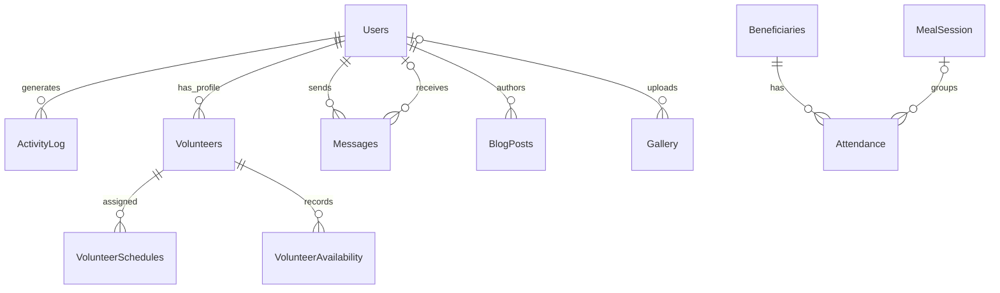

# FSMS MySQL Database Design

## Purpose and DBMS

The Feeding Scheme Management System uses **MySQL 8.0** as its relational database management system (DBMS). The schema is defined in [`sql/schema.sql`](../sql/schema.sql), which creates the `fsms` database, its tables, keys, constraints and indexes. The PHP application connects through PDO; connection settings are read from environment variables in [`config/database.php`](../config/database.php).

This design keeps related information in separate tables and connects records with primary and foreign keys. It supports account management, beneficiaries, feeding sessions and attendance, donations, stock, volunteer scheduling, messaging, announcements, gallery media, and audit history.

## Entity relationship overview

`Donations` and `FoodStock` are currently independent records. The schema does not define a donor entity or a direct relationship between donations and stock.

## Tables and responsibilities

| Table | Purpose and key relationships |
|---|---|
| `Users` | Login identity, contact details, role, account status and timestamps. Parent for activity logs, volunteer profiles, messages, blog posts and gallery uploads. |
| `ActivityLog` | Records an action, optional affected entity and details; `UserID` references `Users`. |
| `Volunteers` | Volunteer profile linked to a user account by `UserID`. |
| `Beneficiaries` | Beneficiary identity, contact details, registration date, status and notes. |
| `MealSession` | Feeding session date, type, location and notes. A unique key covers `(SessionDate, SessionType, Location)`. |
| `Attendance` | Connects a beneficiary to a session date and optionally a `MealSession`; stores attendance status and notes. |
| `Donations` | Donor name/contact, donation type, optional amount/description and donation date. |
| `FoodStock` | Food item, quantity, unit, stock date, optional expiry and notes. |
| `Messages` | Message content and sender/optional recipient, read flag and timestamp. Both user references point to `Users`. |
| `BlogPosts` | Announcement or post content, author and publication date. |
| `Gallery` | Image path, caption/description, optional uploader and upload timestamp. |
| `VolunteerSchedules` | Volunteer shift date, times, location, role, status, hours and notes. |
| `VolunteerAvailability` | Weekly availability by volunteer and day; `(VolunteerID, DayOfWeek)` is unique. |

## Integrity and performance

- Each table has an auto-incrementing integer primary key.
- Foreign keys preserve references between dependent records. Most user/volunteer/beneficiary deletions cascade to their dependent records. Deleting a meal session keeps attendance and clears its optional `MealSessionID`; deleting a recipient or gallery uploader keeps the record and clears the optional user reference.
- `Users.Username` and `Users.Email` are unique. The schema also defines uniqueness for meal-session identity and for one availability record per volunteer/day.
- Indexes support common lookups by attendance beneficiary/session/date, donation date, activity-log user/time, schedule volunteer/date/status, and volunteer availability. Unique constraints also create indexes.
- Dates use `DATE`, times use `TIME`, money uses `DECIMAL(10,2)`, and created/updated fields use MySQL timestamps where appropriate.

## Application connection

`config/database.php` uses PDO with exception mode, associative fetches, native prepared statements, and the `utf8mb4` character set. It accepts `DB_HOST`, `DB_PORT`, `DB_NAME`, `DB_FALLBACKS`, `DB_USERNAME`, `DB_PASSWORD`, and `DB_CHARSET`; local development defaults target a XAMPP MySQL installation. Deployments should provide credentials through environment configuration rather than relying on local defaults.

## Review notes

These are items to consider in a future schema review; they are not changes made by this documentation task:

- `Users.Role`, statuses, donation types, and similar values use MySQL `ENUM`. This is simple for a fixed set of values, while lookup tables may be easier to extend as the application grows.
- Add validation constraints where appropriate, such as non-negative age, stock quantity, donation amount, and valid shift time ranges. Application validation should remain in place as well.
- `MealSession.Location` is nullable while included in a unique key. MySQL permits multiple `NULL` values in a unique index, so sessions with a missing location may not be deduplicated by that key.
- The schema inserts a sample admin account and documents a default password in a comment. Treat it as development-only, remove/replace it for shared or production databases, and provision real credentials securely.
- Review explicit indexes against indexes automatically created to support foreign keys, to avoid redundant indexes.
- `Attendance` includes both `SessionDate` and optional `MealSessionID`. Confirm application rules keep the date consistent with the linked meal session.

## Setup and verification

1. Create/import the schema with a MySQL 8.0 DBMS using the project's documented local setup. The script begins with `CREATE DATABASE IF NOT EXISTS fsms;` and `USE fsms;`.
2. Configure the PHP application's database environment variables and run the application.
3. Check the imported database in a DBMS client (for example, MySQL Workbench or phpMyAdmin): confirm the 13 tables, primary/foreign keys, unique constraints and indexes are present.
4. Exercise representative application workflows for accounts, beneficiaries, feeding sessions/attendance, donations, stock, volunteer schedules, and messages.

This document describes the checked-in schema. It does not claim that a live database import or workflow test was performed as part of writing it.
